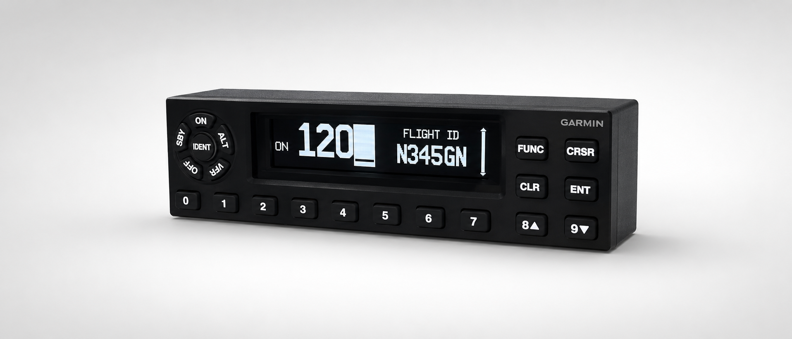

# GTX 335 Flight-Simulator Transponder



A DIY desktop flight-simulator transponder inspired by the Garmin GTX 335 and designed for use with [MobiFlight](https://www.mobiflight.com/). The project combines a custom PCB, a 3D-printed and laser-engraved enclosure, and MobiFlight community firmware.

> [!IMPORTANT]
> This is an unofficial hobby project for flight simulation. It is not a real transponder, does not transmit ADS-B or radio signals, is not certified for aviation use, and is not affiliated with or endorsed by Garmin.

## Features

- Raspberry Pi Pico-based board with a 3.12-inch OLED and 20 illuminated buttons
- Most functions of the real GTX 335 are implemented, including transponder, altitude, and timer functions
- Preconfigured MobiFlight firmware and an example Microsoft Flight Simulator 2024 project

## Repository contents

| Folder | Contents |
|---|---|
| [`pcb`](pcb/README.md) | KiCad source, schematic, bill of materials, component notes, and ready-to-order fabrication archive |
| [`mechanical`](mechanical/README.md) | FreeCAD source, printable parts, laser artwork, print settings, and enclosure assembly notes |
| [`firmware`](firmware/README.md) | MobiFlight community firmware source and build instructions |
| [`firmware/MF_Configs`](firmware/MF_Configs) | Board configuration backup and an example MSFS 2024 MobiFlight project |

## What you need

- The components listed in the [PCB bill of materials](pcb/README.md#bill-of-materials)
- A manufactured and assembled PCB
- The hardware, printed enclosure parts and engraved controls described in the [enclosure guide](mechanical/README.md)
- A Windows PC running [MobiFlight](https://www.mobiflight.com/)
- Microsoft Flight Simulator 2024 if you want to use the included example project

## Quick start

### 1. Build the hardware

Order and assemble the board by following the [PCB guide](pcb/README.md), then print, engrave, and assemble the controls and enclosure by following the [mechanical guide](mechanical/README.md).

Pay particular attention to the OLED configuration and LED polarity of the switches.

### 2. Install the community firmware package

1. Download `GTX335_<version>.zip` from the [latest GitHub release](../../releases/latest).
2. Extract the archive into:

   ```text
   %LocalAppData%\MobiFlight\MobiFlight Connector\Community
   ```

   The resulting directory should be `Community\GTX335`.
3. Restart MobiFlight.
4. Connect the panel over USB and open **Extras > Settings > MobiFlight Modules**.
5. If necessary, reset the Pico from its board context menu. Then choose **Update firmware > Community > JH GTX335**.

The custom device and its twenty named buttons are stored in the firmware configuration, so a manual pin-by-pin setup is not normally required. For screenshots and more detail, see MobiFlight's [Community Board and Custom Devices user guide](https://github.com/MobiFlight/MobiFlight-Connector/wiki/User-guide-%E2%80%90-Community-Board-and-Custom-Devices).

If preferred, build a package from source by following the [firmware build instructions](firmware/README.md).

### 3. Load the MSFS 2024 example project

1. In MobiFlight 11 or newer, open [`firmware/MF_Configs/GTX335_MSFS2024.mfproj`](firmware/MF_Configs/GTX335_MSFS2024.mfproj), or merge its profile into an existing project.
2. If MobiFlight reports a missing controller, use **Extras > Controller Bindings** to bind the profile to the connected `JH GTX335`.
3. Start Microsoft Flight Simulator 2024, load an aircraft, and click **Run** in MobiFlight.

See the MobiFlight documentation for [opening and merging projects](https://docs.mobiflight.com/features/projects/) and [updating controller bindings](https://docs.mobiflight.com/features/controller-bindings/).

The included profile targets the generic MSFS 2024 transponder variables and events. Aircraft with custom avionics may need their own MobiFlight presets or calculator-code mappings.

## Current limitations

- Flight ID is display-only and cannot be entered from the panel.
- The SYS menu is only partially implemented.

## Building the firmware

Developer prerequisites, the PlatformIO command, generated files, and release-version handling are documented in [`firmware/README.md`](firmware/README.md).

## Licence

The firmware is available under the [MIT License](firmware/LICENSE). The PCB, 3D models, fabrication files, artwork, and project documentation are available for non-commercial use under [CC BY-NC-SA 4.0](LICENSE.md).

Third-party names and trademarks are not included in these licences. See the [complete licensing details](LICENSE.md).

## Contributing

Bug reports, tested aircraft mappings, firmware improvements, and fabrication feedback are welcome. When reporting a hardware problem, include the PCB revision, Pico and OLED variants, MobiFlight version, simulator and aircraft, and clear photos where relevant.
