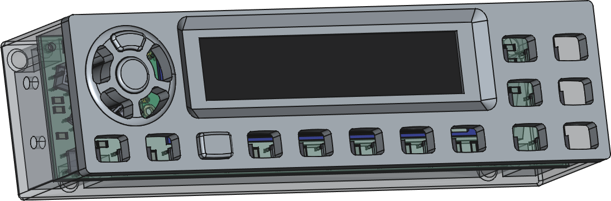
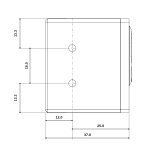

# Enclosure and controls

## Hardware

- 4 × M2 x 15 mm + 3 mm Brass PCB standoff spacers
- 4 × M2 × 6 mm screws
- 4 x M3 x 8 mm screws
- Matte black paint

## 3D Printing

Use:

- White PLA for the buttons and faceplate
- Matte black PLA for the case

### Buttons

Print several spare buttons. They require little filament or paint, and achieving correct laser alignment may take more than one attempt.

Required quantities:

- `button_std`: print at least 2
- All other button models: print at least 1 each

Print the buttons with their top surfaces facing down on a smooth PEI build plate.

Recommended slicer settings:

| Setting | Value |
|---|---|
| Wall generator | Arachne |
| Initial layer flow ratio | 1.06 |
| Bottom surface pattern | Hilbert curve |
| Elephant foot compensation | 0.08 mm |

The Arachne wall generator is recommended because of the thin walls and small printed features.

### Faceplate

Recommended slicer settings:

| Setting | Value |
|---|---|
| Ironing | Enabled |
| Ironing flow | 23% |

## Laser Engraving

Use three separate laser sessions:

1. Faceplate
2. Standard buttons
3. Round and dome buttons

For each session:

1. Focus the laser on the top surface of the printed part.
2. Engrave the alignment outline onto the surface underneath.
3. Position the printed part inside the engraved outline.

Reference settings for a 10 W diode laser:

| Operation | Power | Speed | Focus |
|---|---:|---:|---|
| Standard raster engraving | 15% | 2800 mm/min | Focused |
| Button outline engraving | 50% | 2000 mm/min | Defocused |

## Assembly

Depending on the dimensional accuracy of your printer, the faceplate holes for the PCB standoff spacers may need to be prepared before final assembly.

Carefully form the threads using an M2 self-tapping screw before installing the PCB standoffs or final screws. Keep the screw perpendicular to the printed part and avoid overtightening.

## Mounting

The case includes two M4 side-mounting holes with 16 mm center-to-center spacing. The hole centers are positioned 12 mm from the rear of the case.

