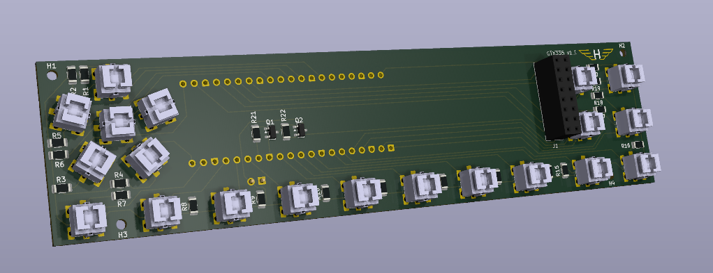
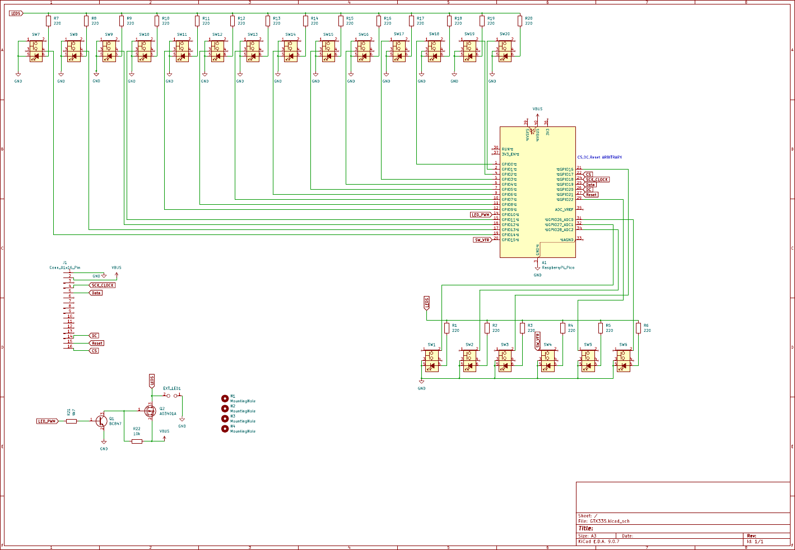
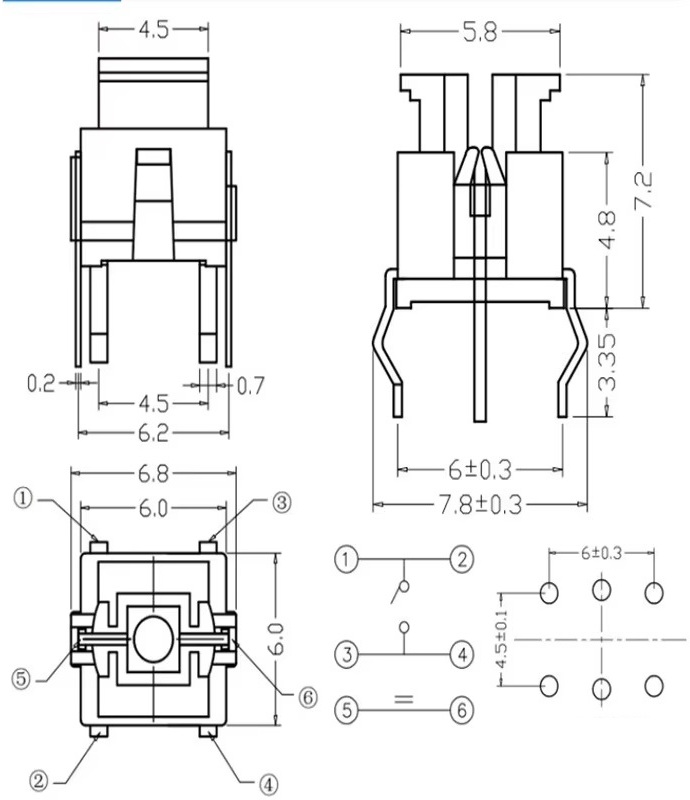
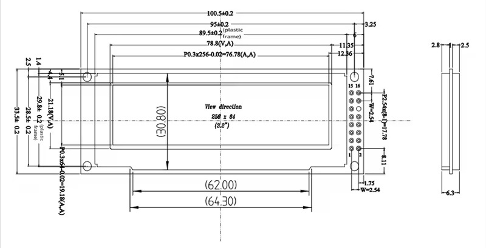
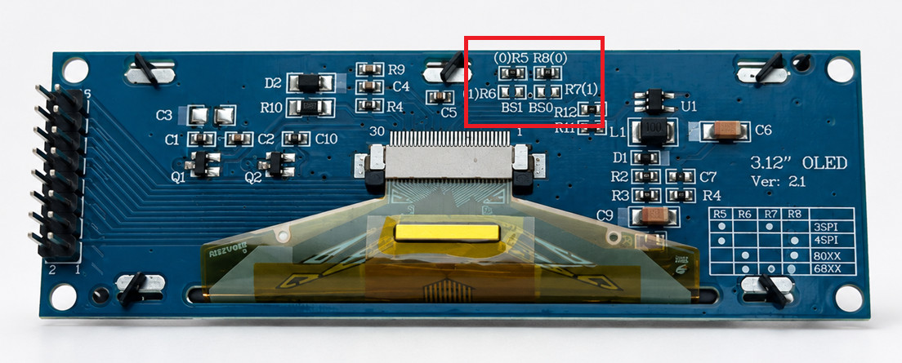

# PCB

## PCB manufacturing

The fabrication files for the latest PCB are included in:

[Download the GTX335 v1.1 PCB fabrication files](./GTX335_v1_1_pcb_fab.zip)

Upload the ZIP archive directly to your PCB manufacturer and select a standard board thickness of **1.6 mm**.

## Schematic

[View the full-resolution schematic](GTX335_Schematic.pdf)

## Bill of materials

| Designators | Quantity | Component | Specification |
|---|---:|---|---|
| SW1-SW20 | 20 | Illuminated tactile switch | 6 x 6 x 7.2 mm, six pins, white LED |
| R1-R20 | 20 | Resistor | 220 ohm, 1206 package |
| R21, R22 | 2 | Resistor | 10 kohm, 1206 package |
| Q1 | 1 | NPN transistor | BC847, SOT-23 package |
| Q2 | 1 | P-channel MOSFET | AO3401A, SOT-23 package |
| J1 | 1 | Socket header | 2 x 8 pins, 2.54 mm pitch, vertical |
| A1 | 2 | Female socket header | 20 pins, 2.54 mm pitch |
| - | 1 | Microcontroller board | Raspberry Pi Pico v1 |
| - | 1 | OLED display | 3.12-inch, 256 x 64 pixels, SSD1322 controller |

## Parts

### Illuminated tactile switches

Use twenty illuminated tactile switches with the following specifications:

- Body size: 6 x 6 mm
- Total height: 7.2 mm
- Number of pins: 6
- Integrated LED colour: white
- Switch contact: normally open

[6 x 6 x 7.2 mm illuminated tactile switch with white LED](https://nl.aliexpress.com/item/1005008121502218.html)

Four pins form the two duplicated switch contacts. The remaining two pins connect the integrated LED.

Verify the dimensions, height, and six-pin layout before ordering. Similar-looking 6 x 6 mm switches may use a different height, LED polarity, pin arrangement, or PCB footprint.

### OLED display

Use a 3.12-inch graphic OLED module with the following specifications:

- Resolution: 256 x 64 pixels
- Controller: SSD1322
- Interface: 4-wire SPI
- Connector: 16 pins
- Module width: approximately 100.5 mm
- Module height: approximately 33.5 mm

[SSD1322 3.12-inch 256 x 64 OLED display](https://nl.aliexpress.com/item/1005003091450549.html)

Check the specs carefully as some OLED screens are sold without the interface board or with different chipsets.

#### OLED pinout

| Pin | Symbol | Function | Use in 4-wire SPI mode |
|---:|---|---|---|
| 1 | VSS | Power-supply ground | Ground |
| 2 | VCC_IN | Positive power supply | Power |
| 3 | NC | Not connected | Not used |
| 4 | D0/CLK | Parallel data D0 / serial clock | SPI clock |
| 5 | D1/DIN | Parallel data D1 / serial data | SPI data |
| 6 | D2 | Parallel data D2 | Not used |
| 7 | D3 | Parallel data D3 | Not used |
| 8 | D4 | Parallel data D4 | Not used |
| 9 | D5 | Parallel data D5 | Not used |
| 10 | D6 | Parallel data D6 | Not used |
| 11 | D7 | Parallel data D7 | Not used |
| 12 | E/RD# | Enable / read | Not used after interface configuration |
| 13 | R/W# | Read / write | Not used after interface configuration |
| 14 | D/C# | Data / command selection | Data/command |
| 15 | RES# | Reset | Reset |
| 16 | CS# | Chip selection | Chip select |

### Raspberry Pi Pico

Use a **Raspberry Pi Pico v1** fitted with two 20-pin, 2.54 mm pitch headers.

The PCB is designed for the original RP2040-based Raspberry Pi Pico. Other Pico variants are not currently supported.

Install the Pico in the two corresponding 20-pin header rows on the PCB.

## Assembly notes

### Configure the OLED for 4-wire SPI

Before installing the OLED module, configure it for the **4-wire SPI interface**. This mode may be marked as **4SPI** on the display PCB.

Configure the interface-selection jumpers by soldering the required **0 ohm jumper resistors** according to the 4SPI configuration shown for the module.

### Install the illuminated tactile switches

Each tactile switch contains a polarity-sensitive LED.

The **small square PCB pad is ground** and must connect to the negative LED terminal (short).

To test the switch LEDs during assembly, apply 3–5 V DC to pin 2 of the EXT LED connector and connect the supply ground to any PCB ground point.
